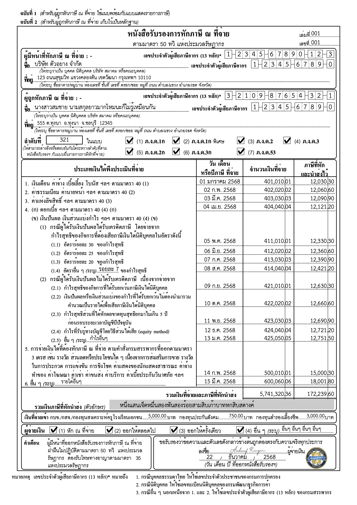

# pdf50tawi-rust

[](https://www.rust-lang.org)
[](LICENSE)

Rust library สำหรับสร้างไฟล์ PDF หนังสือรับรองการหักภาษี ณ ที่จ่าย (แบบ 50 ทวิ) พร้อมรองรับภาษาไทยเต็มรูปแบบ

Rust library for generating Thai Withholding Tax certificates (แบบ 50 ทวิ) as ready-to-sign PDFs with full Thai language support.



---

## Demo

```bash
make demo-cli

# or

make demo-rest
```

## เริ่มต้นใช้งาน / Quick start

```toml
# Cargo.toml
[dependencies]
pdf50tawi = { git = "https://github.com/anuchito/pdf50tawi-rust" }
```

```rust
use std::fs::File;
use pdf50tawi::{
    issue_wht_certificate_pdf, load_image_from_file,
    tax_info::{
        Certification, DateOfIssuance, IncomeDetail, Payee, Payer,
        TaxInfo, Totals, WithholdingType,
    },
};

fn main() {
    // กรอกข้อมูลภาษี
    let tax_info = TaxInfo {
        payer: Payer {
            tax_id: "1234567890123".to_string(),
            name: "บริษัท ตัวอย่าง จำกัด".to_string(),
            address: "123 ถนนสุขุมวิท แขวงคลองตัน เขตวัฒนา กรุงเทพฯ 10110".to_string(),
            ..Default::default()
        },
        payee: Payee {
            tax_id: "3210987654321".to_string(),
            name: "นาย ผู้รับเงิน".to_string(),
            pnd_3: true, // ระบุประเภท ภ.ง.ด. ที่ใช้
            ..Default::default()
        },
        income40_1: IncomeDetail {
            date_paid: "01 มกราคม 2568".to_string(),
            amount_paid: "100,000.00".to_string(),
            tax_withheld: "3,000.00".to_string(),
        },
        totals: Totals {
            total_amount_paid: "100,000.00".to_string(),
            total_tax_withheld: "3,000.00".to_string(),
            total_tax_withheld_in_words: "สามพันบาทถ้วน".to_string(),
        },
        withholding_type: WithholdingType { withholding_tax: true, ..Default::default() },
        certification: Certification {
            date_of_issuance: DateOfIssuance {
                day: "1".to_string(),
                month: "มกราคม".to_string(),
                year: "2568".to_string(),
            },
        },
        ..Default::default()
    };

    // โหลดรูปลายเซ็นและตราประทับ
    let sign = load_image_from_file("signature.png").ok();
    let seal = load_image_from_file("logo.png").ok();

    // สร้างไฟล์ PDF
    let mut out = File::create("certificate.pdf").unwrap();
    issue_wht_certificate_pdf(&mut out, tax_info, sign, seal).unwrap();
}
```

---

## โหลดรูปภาพ / Loading images

library รับรูปภาพเป็น `Option<Vec<u8>>` ซึ่งมี helper function ให้เลือกใช้ตามแหล่งที่มาของรูป

```rust
// จากไฟล์ในเครื่อง / From a local file
let sign = load_image_from_file("signature.png")?;

// จาก URL สาธารณะ / From a public URL
let sign = load_image_from_url("https://storage.example.com/signature.png")?;
```

> ถ้าไม่มีรูปลายเซ็นหรือตราประทับ ส่ง `None` ได้เลย — ระบบจะข้ามช่องนั้นให้อัตโนมัติ
>
> Pass `None` for either image to omit it from the certificate.

---

## REST API — 3 วิธีส่งรูปภาพ / 3 image strategies

server ตัวอย่าง ([`src/bin/rest.rs`](src/bin/rest.rs)) แสดง 3 วิธีส่งรูปภาพมากับ request ให้เลือกใช้ตามความเหมาะสม

| วิธี / Strategy | Endpoint | เหมาะเมื่อ / When to use |
|----------------|----------|--------------------------|
| **A** Multipart upload | `POST /api/v1/taxes/multipart` | client upload ไฟล์โดยตรง |
| **B** Base64 ใน JSON | `POST /api/v1/taxes/base64` | API client ที่รับส่งแค่ JSON |
| **C** ส่ง URL มา | `POST /api/v1/taxes/url` | รูปอยู่บน CDN / S3 อยู่แล้ว |

**วิธี A — multipart/form-data**
```bash
curl -X POST http://localhost:8080/api/v1/taxes/multipart \
  -F "taxInfo={...}" \
  -F "signature=@signature.png" \
  -F "seal=@logo.png" \
  -o certificate.pdf
```

**วิธี B — base64 ใน JSON body**
```bash
curl -X POST http://localhost:8080/api/v1/taxes/base64 \
  -H "Content-Type: application/json" \
  -d '{
    "taxInfo": {...},
    "signatureBase64": "<base64>",
    "sealBase64": "<base64>"
  }' \
  -o certificate.pdf
```

**วิธี C — ส่ง URL ให้ server ดึงเอง**
```bash
curl -X POST http://localhost:8080/api/v1/taxes/url \
  -H "Content-Type: application/json" \
  -d '{
    "taxInfo": {...},
    "signatureURL": "https://cdn.example.com/signature.png",
    "sealURL": "https://cdn.example.com/logo.png"
  }' \
  -o certificate.pdf
```

---

## CLI

```bash
# รันด้วยข้อมูลตัวอย่าง / Run with demo data
make demo-cli

# รันด้วยรูปของคุณเอง / Run with your own images
cargo run --bin cli -- \
  --signature path/to/signature.png \
  --seal      path/to/logo.png \
  --output    certificate.pdf
```

---

## ข้อกำหนดรูปภาพ / Image requirements

รูปภาพควรเป็น **PNG พื้นหลังโปร่งใส** และมีขนาดตามนี้เพื่อให้ตรงกับช่องในฟอร์ม

| รูป / Image | ขนาด / Dimensions | รูปแบบ / Format |
|-------------|-------------------|-----------------|
| ลายเซ็น / Signature | 1280 × 720 px | PNG, พื้นหลังโปร่งใส |
| ตราประทับ / Seal (สี่เหลี่ยมจัตุรัส) | 1024 × 1024 px | PNG, พื้นหลังโปร่งใส |
| ตราประทับ / Seal (สี่เหลี่ยมผืนผ้า) | 1280 × 720 px | PNG, พื้นหลังโปร่งใส |

---

## รายการ field ทั้งหมด / TaxInfo reference

<details>
<summary>ดู field ทั้งหมด / Show all fields</summary>

```rust
pub struct TaxInfo {
    pub document_details: DocumentDetails, // เลขที่เล่ม / เลขที่

    pub payer: Payer,  // ผู้จ่ายเงิน
    pub payee: Payee,  // ผู้มีเงินได้ — ระบุประเภท ภ.ง.ด. ด้วย bool fields

    pub income40_1:  IncomeDetail, // 1. เงินเดือน ค่าจ้าง ตามมาตรา 40(1)
    pub income40_2:  IncomeDetail, // 2. ค่าธรรมเนียม ค่านายหน้า ตามมาตรา 40(2)
    pub income40_3:  IncomeDetail, // 3. ค่าแห่งลิขสิทธิ์ ตามมาตรา 40(3)
    pub income40_4a: IncomeDetail, // 4(ก) ดอกเบี้ย ตามมาตรา 40(4)(ก)

    // 4(ข) เงินปันผล — กรณีได้รับเครดิตภาษี
    pub income40_4b_1_1:      IncomeDetail,
    pub income40_4b_1_2:      IncomeDetail,
    pub income40_4b_1_3:      IncomeDetail,
    pub income40_4b_1_4_rate: String,       // อัตราอื่น ๆ (ระบุ)
    pub income40_4b_1_4:      IncomeDetail,

    // 4(ข) เงินปันผล — กรณีไม่ได้รับเครดิตภาษี
    pub income40_4b_2_1:      IncomeDetail,
    pub income40_4b_2_2:      IncomeDetail,
    pub income40_4b_2_3:      IncomeDetail,
    pub income40_4b_2_4:      IncomeDetail,
    pub income40_4b_2_5_note: String,       // อื่น ๆ (ระบุ)
    pub income40_4b_2_5:      IncomeDetail,

    pub income5:      IncomeDetail, // 5. การจ่ายเงินได้ที่ต้องหักภาษี ณ ที่จ่าย
    pub income6_note: String,       // 6. อื่น ๆ (ระบุ)
    pub income6:      IncomeDetail,

    pub totals:          Totals,          // รวมเงินได้และภาษีที่หัก
    pub other_payments:  OtherPayments,   // กบข. / ประกันสังคม / กองทุนสำรองเลี้ยงชีพ
    pub withholding_type: WithholdingType, // ประเภทการหักภาษี
    pub certification:   Certification,   // วันที่ออกหนังสือรับรอง
}
```

</details>

---

## ขนาดไฟล์ผลลัพธ์ / Output size

| สถานการณ์ / Scenario | ขนาดไฟล์ / File size |
|----------------------|----------------------|
| ข้อมูลข้อความ ไม่มีรูปภาพ / Text only | ~150 KB |
| พร้อมลายเซ็น + ตราประทับ / With signature + seal | ~400–500 KB |

---

## ไลบรารีที่เกี่ยวข้อง / Related

- [pdf50tawi](https://github.com/anuchito/pdf50tawi) — Go version of this library

---

## License

MIT
